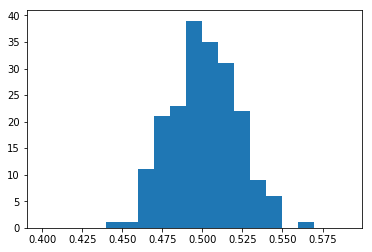
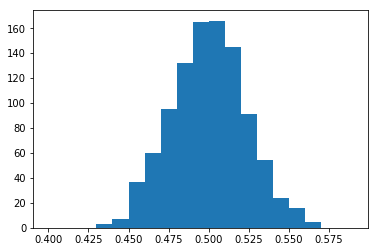
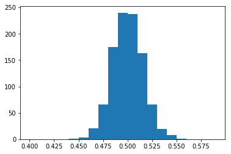
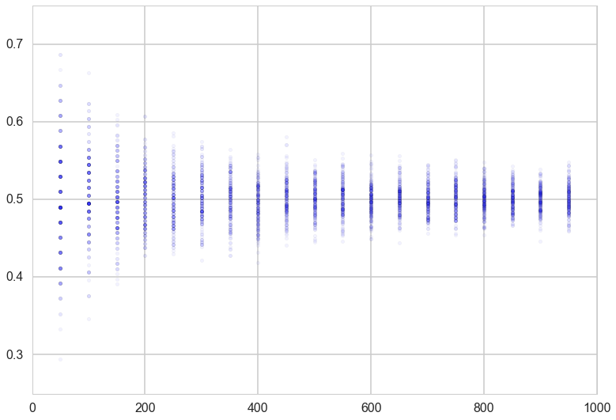
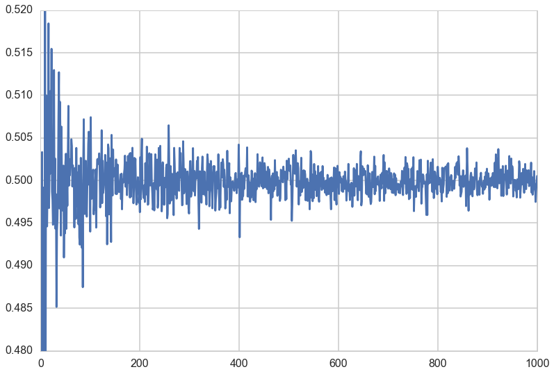
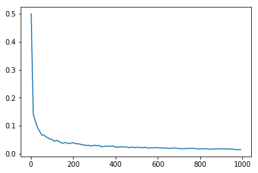
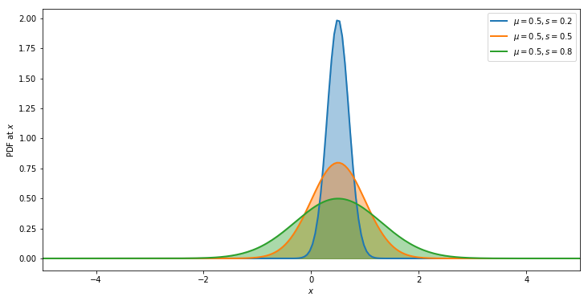
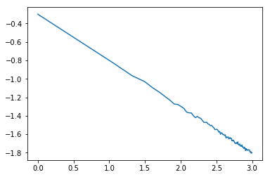

autoscale: true
footer: Hult University

##[fit] Central Limit Theorem
##[fit] and Sampling Distributions:
##[fit] Gaussian Distributions

---

## Coin flip example

- We have a coin, and we flip it N times. We'll call it a sample. As we increase N, we get a better estimate of the true probability of heads.
- in our coins example, the true proportion, called $$p^{*}$$ comes from all possible (infinite) coin flips. We never get to see this
- This of course depends on if our model describes the true generating process for the data, otherwise we can find a $$p^{*}$$ given a population, but still have model mis-specification error
- if we are only given one (finite sample sized) replication, which is the situation in real life, we can only estimate a probability $${\hat p}$$
- In our idealized, simulated case we have many $$M$$ replications, and thus samples, and we can now find the **distribution** of estimated probabilities $${\hat p}$$

---

## M replications of N coin tosses

---

## Sampling distribution

As we let $$M \rightarrow \infty$$, for any N, the distribution induced on $$\hat{p}$$ is the empirical **sampling distribution of the estimator** of the true probability $$p^{*}$$.

We could use the sampling distribution to get confidence intervals on $$\hat{p}$$.

$$\hat{p}$$ itself is a mean value, a mean of the 1s corresponding to heads and 0s corresponding to the tails.

Thus the distribution of $$\hat{p}$$ is the **sampling distribution of the mean** of each sample

---

## 200 replications of N coin tosses

- If the heads are given the value 1 and the tails are given the value 0 then the mean of the sample gives us the fraction of heads in each replication
- these means will be **different**! The fluctuations from one replication to another is called a **distribution**

200 reps, 491 flips per sample -->

---

## What if we increase the size of each sample?

#### 1000 ( $$\infty$$) replications of N coin tosses, left: N=491, right: N=982

---

# Properties of this distribution

- We can average this fraction over the replications..a mean of sample means.
- We can also calculate the standard deviation of these means.
- How do these vary with the size of the sample?

---

## Distribution of Sample Means

---

## mean and standard deviation of sample means

---

## Sample means and the population mean

Let $$x_1,x_2,...,x_n$$ be a sequence of IID values from random variable $$X$$, which has some distribution with finite mean $$\mu$$.

Define $$E_{\{R\}}(x)$$ to be the average in the vertical direction (axis=0) of the value $$x$$, for example the average of all the first coin's 1s and 0s in the replications.

---

Then,

$$E_{\{R\}}(N\,\bar{x}) = E_{\{R\}}(x_1 + x_2 + ... + x_N) = E_{\{R\}}(x_1) + E_{\{R\}}(x_2) + ... + E_{\{R\}}(x_N)$$

In limit $$M \rightarrow \infty$$ of replications, each and every one of the expectations in RHS can be replaced by the population mean $$\mu$$ using the law of large numbers! Thus:

$$\begin{eqnarray}
E_{\{R\}}(N\,\bar{x}) &=& N\, \mu\\
E_{\{R\}}(\bar{x}) &=& \mu
\end{eqnarray}$$

In limit $$M \rightarrow \infty$$ of replications the expectation value of the sample means converges to the population mean.

---

Now let underlying distribution on the population have well defined mean $$\mu$$ AND a well defined variance $$\sigma^2$$.

$$V_{\{R\}}(N\,\bar{x}) = V_{\{R\}}(x_1 + x_2 + ... + x_N) = V_{\{R\}}(x_1) + V_{\{R\}}(x_2) + ... + V_{\{R\}}(x_N)$$

Now in limit $$M \rightarrow \infty$$, each of the variances in the RHS can be replaced by the population variance using the law of large numbers! Thus:

$$\begin{eqnarray}
V_{\{R\}}(N\,\bar{x}) &=& N\, \sigma^2\\
V(\bar{x}) &=& \frac{\sigma^2}{N}
\end{eqnarray}$$

---

## These sampling distributions are Gaussian

$$p(y \vert \mu, \sigma^2) =  \frac{1}{ \sqrt{ 2 \pi \sigma^2}} e^
{-( \frac{y-\mu}{2 \sigma})^2}$$

---

## The Central Limit Theorem (CLT)

Let $$x_1,x_2,...,x_n$$ be a sequence of IID values from a random variable $$X$$. Suppose that $$X$$ has the finite mean $$\mu$$ AND finite variance $$\sigma^2$$. Then:

$$S_n = \frac{1}{n} \sum_{i=1}^{n} x_i ,$$ converges to

$$ S_n \sim N(\mu,\frac{\sigma^2}{n}) \, as \, n \to \infty. $$

---

## log(standard error) vs log(N)

---

## What did we do here?

- we asked the question of a population: whats the mean of a bernoulli sequence of coins (H=1, T=0)
- we realized we only had samples to solve this on, so did it there
- then we asked, whats the distribution of these means
- it turns out to be gaussian
- with a mean equal to what the population mean would have been
- and a variance equal to the population mean divided by the sample size
- so that when the samples become the population their individual means converge to the population mean

---

## Meaning

- weight-watchers’ study of 1000 people, average weight is 150 lbs with $$\sigma$$ of 30lbs.
- Randomly choose many samples of 100 people each, the mean weights of those samples would cluster around 150lbs with a standard error of 3lbs.
- a different sample of 100 people with an average weight of 170lbs would be more than 6 standard errors beyond the population mean.

---

#[fit] Frequentist Statistics

Answers the question: **What is Data?** with

>"data is a **sample** from an existing **population**"

- data is stochastic, variable, in the sense that you can draw different samples
- model the sample. The model may have parameters
- The parameters are considered **FIXED**, and there is a **true value** in our population
- However, we can only find parameters for our sample, since in real-life we usually only get to see one sample.
- If we could somehow access multiple samples, these parameters would vary from sample to sample

---
