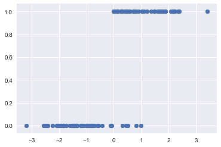
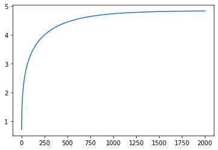

autoscale: true
footer: Hult University
slidenumbers: true

#[fit] Maximum
#[fit] Likelihood
#[fit] Estimation

---

## Frequentist Statistics

Answers the question: **What is Data?** with

>"data is a **sample** from an existing **population**"

- data is stochastic, variable
- model the sample. The model may have parameters
- find parameters for our sample. The parameters are considered **FIXED**.

---

## Our coin flip example

- in our coins example, the true proportion, called $$p^{*}$$ comes from all possible (infinite) coin flips. We never get to see this
- This of course depends on if our model describes the true generating process for the data, otherwise we can find a $$p^{*}$$ given a population,
 but still have model mis-specification error
- if we are only given one (finite sample sized) replication, which is the situation in real life, we can only estimate a probability $${\hat p}$$
- In our idealized, simulated case we have many $$M$$ replications, and thus samples, and we can now find the **distribution** of estimated probab
ilities $${\hat p}$$

Lets start by focussing on how to find one $${\hat p}$$

---

## Likelihood

How likely it is to observe values $$x_1,...,x_n$$ given the parameters $$\theta$$?

$$
L(\lambda) = P(\{x_i\} | \theta) = \prod_{i=1}^n P(x_i | \theta)
$$

How likely are the observations if the model is true?

Remember, if your model describes the true generating process for the data, then there is some true $$\theta^*$$. We dont know this. The best we can do is to estimate $$\hat{\theta}$$.

---

## Maximum Likelihood estimation


---

## Example: Exponential Distribution Model

$$
f(x;\lambda) = \begin{cases}
\lambda e^{-\lambda x} & x \ge 0, \\
0 & x < 0.
\end{cases}
$$

Describes the time between events in a homogeneous Poisson process (events occur at a constant average rate). Eg time buses arriving, radioactive decay, telephone calls and requests for a particular document on a web server

---

Consider the arrival times of the babies in a hospital. There is no reason to expect any specific clustering in time, so one could think of modelling the arrival of the babies via a poisson process.


---

## log-likelihood

Maximize the likelihood, or more often (easier and more numerically stable), the log-likelihood

$$
\ell(\lambda) = \sum_{i=1}^n ln(P(x_i \mid \lambda))
$$

In the case of the exponential distribution we have:

$$
\ell(lambda) = \sum_{i=1}^n ln(\lambda e^{-\lambda x_i}) = \sum_{i=1}^n \left( ln(\lambda) - \lambda x_i \right).
$$

---

[.column]

Maximizing this:

$$
\frac{d \ell}{d\lambda} = \frac{n}{\lambda} - \sum_{i=1}^n x_i = 0
$$

and thus:

$$
\frac{1}{\hat{\lambda_{MLE}}} = \frac{1}{n}\sum_{i=1}^n x_i,
$$

which is the sample mean of our sample.

[.column]


```python
lambda_from_mean = 1./timediffs.mean()
minutes=np.arange(0, 160, 5)
rv = expon(scale=1./lambda_from_mean)
plt.plot(minutes,rv.pdf(minutes),'.')
timediffs.hist(density=True, alpha=0.5, bins=20);
```

---

## INFERENCE: True vs estimated

If your model describes the true generating process for the data, then there is some true $$\theta^*$$.

We dont know this. The best we can do is to estimate $$\hat{\theta}$$.

Now, imagine that God gives you some M data sets **drawn** from the population, and you can now find $$\theta$$ on each such dataset.

So, we'd have M estimates.

---

## Sampling distribution

As we let $$M \rightarrow \infty$$, the distribution induced on $$\hat{\theta}$$ is the empirical **sampling distribution of the estimator**.

We could use the sampling distribution to get confidence intervals on $$\theta$$.

But we dont have M samples. What to do?

---

## M samples of N data points


---

## Bootstrap

- If we knew the true parameters of the population, we could generate M fake datasets.
- we dont, so we use our estimate $$\hat{\theta}$$ to generate the datasets
- this is called the Parametric Bootstrap
- usually best for statistics that are variations around truth

(diagram from Shalizi)


---

## Non Parametric Bootstrap[^1]


Specification error: what if the model isnt quite good?

Then Sample with replacement the X from our original sample D, generating many fake datasets.

Use the empirical distribution!

[^1]: (from Shalizi)

---

#[fit] CLASSIFICATION

- will a customer churn?
- is this a check? For how much?
- a man or a woman?
- will this customer buy?
- do you have cancer?
- is this spam?
- whose picture is this?
- what is this text about?[^j]


[^j]:image from code in http://bit.ly/1Azg29G

---

## 1-D classification problem



---

## 1-D Using Linear regression


---

## Logistic regression..split via line


Draw a line in feature space that divides the '1' (blue) samples from the '0' (red)samples.

Now, a line has the form $$w_1 x_1 + w_2 x_2 + b = 0$$ in 2-dimensions.

Our classification rule then becomes:

$$
\begin{eqnarray}
y = 1 & ,\,\, & \v{w}\cdot\v{x} + b \ge 0\\
y = 0 & ,\,\, & \v{w}\cdot\v{x} + b < 0
\end{eqnarray}
$$

Highly positive and negative values go far from this line!

---

## Sigmoid Function


Consider the **sigmoid** function:

$$h(z) = \frac{1}{1 + e^{-z}}$$ with the identification

$$z = \v{w}\cdot\v{x} + b$$


- At $$z=0$$ this function has the value 0.5.
- If $$z > 0$$, $$h > 0.5$$ and as $$z \to \infty$$, $$h \to 1$$.
- If $$z < 0$$, $$h < 0.5$$ and as $$z \to -\infty$$, $$h \to 0$$.

As long as we identify any value of $$h > 0.5$$ as classified to '1', and any $$h < 0.5$$ as 0, we can achieve what we wished above.

---


## Sigmoid Probability


The further away we are from the dividing line, the better our classification.
As $$z \to \infty$$, $$h \to 1$$. As $$z \to -\infty$$, $$h \to 0$$.

Pure certainty of a '1' and of not being a '1', respectively.

Identify:  $$h(z) = \frac{1}{1 + e^{-z}}$$ as the **probability that the data point is a '1'**.


Since $$\renewcommand{\v}[1]{\mathbf #1} z = \v{w}\cdot\v{x} + b$$, this is a affine function FOLLOWED by a **non-linearity**. This is called a Generalized Linear Model (GLM).

---

## Bernoulli

Then, the conditional probabilities of $$y=1$$ or $$y=0$$ given a particular data point's features $$\renewcommand{\v}[1]{\mathbf #1} \v{x}$$ are:

$$\begin{eqnarray}
\renewcommand{\v}[1]{\mathbf #1}
P(y=1 | \v{x}) &=& h(\v{w}\cdot\v{x} + b) \\
P(y=0 | \v{x}) &=& 1 - h(\v{w}\cdot\v{x} + b).
\end{eqnarray}$$

These two can be written together as

$$\renewcommand{\v}[1]{\mathbf #1} P(y|\v{x}, \v{w}) = h(\v{w}\cdot\v{x} + b)^y \left(1 - h(\v{w}\cdot\v{x} + b) \right)^{1-y} $$


---

## MLE for Logistic Regression

- "Squeeze" linear regression through a **Sigmoid** function
- this bounds the output to be a probability
- now multiply probabilities to get the "maximum likelihood" of the data, given the parameters.

---

Multiplying over the samples we get:

$$\renewcommand{\v}[1]{\mathbf #1} P(y|\v{x},\v{w}) = P(\{y_i\} | \{\v{x}_i\}, \v{w}) = $$

$$\prod_{y_i \in \cal{D}} P(y_i|\v{x_i}, \v{w}) = \prod_{y_i \in \cal{D}} h(\v{w}\cdot\v{x_i} + b)^{y_i} \left(1 - h(\v{w}\cdot\v{x_i} + b) \right)^{(1-y_i)}$$

 **maximum likelihood** estimation maximises the **likelihood of the sample y**, or alternately the log-likelihood,

$$\renewcommand{\v}[1]{\mathbf #1} {\cal L} = P(y \mid \v{x},\v{w}).$$ OR $$\renewcommand{\v}[1]{\mathbf #1} \ell = log(P(y \mid \v{x},\v{w}))$$

---

Thus

$$\renewcommand{\v}[1]{\mathbf #1} \begin{eqnarray}
\ell &=& log\left(\prod_{y_i \in \cal{D}} h(\v{w}\cdot\v{x_i} + b)^{y_i} \left(1 - h(\v{w}\cdot\v{x_i} + b) \right)^{(1-y_i)}\right)\\
                  &=& \sum_{y_i \in \cal{D}} log\left(h(\v{w}\cdot\v{x_i} + b)^{y_i} \left(1 - h(\v{w}\cdot\v{x_i} + b) \right)^{(1-y_i)}\right)\\
                  &=& \sum_{y_i \in \cal{D}} log\,h(\v{w}\cdot\v{x_i} + b)^{y_i} + log\,\left(1 - h(\v{w}\cdot\v{x_i} + b) \right)^{(1-y_i)}\\
                  &=& \sum_{y_i \in \cal{D}} \left ( y_i log(h(\v{w}\cdot\v{x} + b)) + ( 1 - y_i) log(1 - h(\v{w}\cdot\v{x} + b)) \right )
\end{eqnarray}$$

---

## Logistic Regression: NLL

The negative of this log likelihood (NLL), also called *cross-entropy*.

$$\renewcommand{\v}[1]{\mathbf #1} NLL = - \sum_{y_i \in \cal{D}} \left ( y_i log(h(\v{w}\cdot\v{x} + b)) + ( 1 - y_i) log(1 - h(\v{w}\cdot\v{x}) + b) \right )$$

Gradient:  $$\renewcommand{\v}[1]{\mathbf #1} \nabla_{\v{w}} NLL = \sum_i \v{x_i}^T (p_i - y_i) = \v{X}^T \cdot ( \v{p} - \v{w} )$$

Hessian: $$\renewcommand{\v}[1]{\mathbf #1} H = \v{X}^T diag(p_i (1 - p_i))\v{X}$$ positive definite $$\implies$$ convex

---

## How to calculate?

Use Layers.

[.column]

```python
class Layer:
    def __init__(self, name):
        self.name = name
        self.params = {}
        self.grads = {}
    def forward(self, inputs):
        raise NotImplementedError
    def backward(self, grad):
        raise NotImplementedError
```
Layers replace functions.

[.column]


You can think of 3 layers in Logistic Regression.

1. Affine Function
2. Sigmoid
3. Loss.

We will feed the gradients backward from loss to affine.

---

## Layer based diagram


$$z_{0i} = x_i,\,\, z_{1i} = wx_i + b,\,\, z_{2i} = h(z_{1i}),\,\, Loss = - \sum_i y_i log(z_{2i} + (1-y_i) log (1 - z_{2i})$$

---

## Backpropagation

The *forward* mode, implemented with dunder `__call__` makes a **prediction**, thus:

$$\renewcommand{\v}[1]{\mathbf #1}{\v Model} = (\v{f}^3(\v{f}^2(\v{f}^1(\v{x})))), \,\,Loss = f^4({\v Model})$$. Loss is scalar.

*Backpropagation*: pass gradients **back** through layers:

$$\renewcommand{\v}[1]{\mathbf #1}\nabla_{\v{x}} Loss = \frac{\partial f^{4}}{\partial \v{f}^3}\,\frac{\partial \v{f}^3}{\partial \v{f}^2}\,\frac{\partial \v{f}^2}{\partial \v{f}^1}\frac{\partial \v{f}^1}{\partial \v{x}} = (((\frac{\partial f^{4}}{\partial \v{f}^3}\,\frac{\partial \v{f}^3}{\partial \v{f}^2})\,\frac{\partial \v{f}^2}{\partial \v{f}^1})\,\frac{\partial \v{f}^1}{\partial \v{x}})$$

You **pass in** vector, **always** multiply vector by matrix, get **vector**, pass it **back**. Huge Memory Savings!

---

## Affine Layer

[.column]

```python
class Affine(Layer):
    def __init__(self, name, input_dims):
        super().__init__(name)
        self.params['w'] = np.random.randn(input_dims, 1)
        self.params['b'] = np.random.randn(1,)
        self.grads['w'] = np.zeros((input_dims, 1))
        self.grads['b'] = np.array([0.])

    def forward(self, inputs):
        self.inputs = inputs
        return inputs@self.params['w'] + self.params['b']

    def backward(self, grad):
        # (m,n) @ (n,  1) = (m, 1)
        #print("gradshape", grad.shape)
        self.grads['w'] = self.inputs.T @ grad
        # (n, 1) @ (n, 1) = (1,)
        self.grads['b'] = np.sum(grad, axis=0)
        # return (n, 1) @ (1 , m) = (n, m)
        return grad@self.params['w'].T
```

$$\frac{\partial Loss}{\partial z_{0u}} = \sum_v \delta^{1}_v \, \frac{\partial z_{1,v}}{\partial z_{0u}} $$ = `grad@self.params['w'].T`

[.column]

Already done these!

$$\frac{\partial Loss}{\partial \theta^0} = \sum_u \delta^{1}_u \frac{\partial z_{1,u}}{\partial \theta^0}$$

$$\frac{\partial Loss}{\partial w} = \sum_u \delta^{1}_u \frac{\partial z_{1,u}}{\partial w}$$ = `self.inputs.T @ grad`

$$\frac{\partial Loss}{\partial b} = \sum_u \delta^{1}_u \frac{\partial z_{1,u}}{\partial b}$$ = `np.sum(grad, axis=0)`

---

## `Model` holds everything together

[.column]
```python
class Model:
    def __init__(self, layers):
        self.layers = layers

    def forward(self, inputs):
        for layer in self.layers:
            inputs = layer.forward(inputs)
        return inputs

    def backward(self, grad):
        for layer in reversed(self.layers):
            grad = layer.backward(grad)
        return grad

    def params_and_grads(self):
        for layer in self.layers:
            for name, param in layer.params.items():
                grad = layer.grads[name]
                yield layer, name, param, grad
```

[.column]

- Dunder `forward` runs through the layers forward, making a prediction.
- `backward` runs through them in reversed order, passing the returned gradient with respect to a layer's inputs backwards through the model.
- in python software, `backward` is implemented automatically!!

---

## Losses


---

## Parameters



---

## Classification Using Logistic regression


$$ z = wx = b $$

$$ p = h(z) = \frac{1}{1+e^{-z}} = \frac{1}{1 + e^{-(wx+b)}}$$

if $$p \ge 0.5$$ classify as positive. We make some misclassifications:

```
Pred    0     1
     [[245,   5],   0
      [  5, 245]]   1
                    Obsv
```


---

## Sampling Distribution

We have focussed on prediction here.

But its important to realize that a particular sample of 1's and 0s can be thought of as a draw from some "true" probability distribution.

The various "datasets" that can be generated given our probabilities are the samples, and you can get sampling distributions on $$w$$ and $$b$$.

---

## Gradient Descent

$$\theta := \theta - \eta \nabla_{\theta} J(\theta) = \theta -\eta \sum_{i=1}^m \nabla J_i(\theta)$$

where $$\eta$$ is the learning rate.

ENTIRE DATASET NEEDED

```python
for i in range(n_epochs):
  params_grad = evaluate_gradient(loss_function, data, params)
  params = params - learning_rate * params_grad`
```

---
